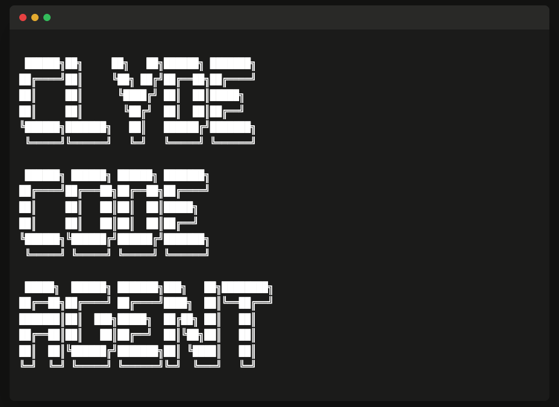

<div align="center">



</div>

# Clyde Code Agent Installer

Public installer for [Clyde Code Agent](https://github.com/satori-ai-tech/clyde-code) - Digital Labor for software development.

## What is Clyde Code Agent?

Clyde Code Agent is **Digital Labor** - an AI developer that:
- **Remembers everything** across all sessions
- **Learns from mistakes** and never repeats them
- **Works from GitHub Issues** like a real developer
- **Ships to production** with built-in safety protocols
- **Communicates via voice** like a team member

## Prerequisites

- **GitHub account** with collaborator access to `satori-ai-tech/clide-code`
- **Git** installed
- **GitHub CLI** (recommended): https://cli.github.com/

## Installation

### Step 1: Authenticate with GitHub (One-Time)

```bash
# Install GitHub CLI if needed
brew install gh  # macOS
# or visit: https://cli.github.com/

# Authenticate
gh auth login
# Select: HTTPS protocol (important!)
```

### Step 2: Install Clyde Code Agent

```bash
curl -sSL https://raw.githubusercontent.com/satori-ai-tech/clyde-installer/main/install.sh | bash
```

### Step 3: Configure and Launch

```bash
# Edit project context
nano .claude/docs/proj.md

# Launch Clyde
./clyde.sh
```

## Alternative: Without GitHub CLI

If you don't have GitHub CLI:

```bash
# Configure git to store credentials
git config --global credential.helper store

# Run installer
curl -sSL https://raw.githubusercontent.com/satori-ai-tech/clyde-installer/main/install.sh | bash

# Enter GitHub credentials when prompted
```

## What the Installer Does

1. Clones the private `clyde-code` repository (requires authentication)
2. Installs `.claude/` directory into your project
3. Copies launcher script to project root (`clyde.sh`)
4. Creates fresh memory bank database
5. Generates project template at `.claude/docs/proj.md`

## Troubleshooting

### "Failed to clone repository"

**Cause**: Not authenticated or missing collaborator access

**Solution**:
1. Run `gh auth login` and select HTTPS
2. Contact support@satori-ai-tech.com if you purchased access

### "Directory .claude already exists"

**Cause**: Clyde Code Agent already installed

**Solution**:
```bash
# Remove existing installation
rm -rf .claude clyde.sh

# Or upgrade instead
cd .claude && ./tools/upgrade.sh
```

## Support

- **Email**: support@satori-ai-tech.com
- **Documentation**: [GitHub - clyde-code](https://github.com/satori-ai-tech/clyde-code) (requires access)
- **Purchase Access**: https://satori-ai-tech.com

## About Clyde Code Agent

Clyde Code Agent is developed by **Satori AI Tech** as part of our Digital Labor initiative.

Digital Labor represents the next evolution of AI assistance - not tools that help you code, but AI team members that code *for* you. With persistent memory, the ability to learn from mistakes, and trust to deploy production systems, Clyde Code Agent demonstrates what's possible when AI works like humans work.

**Learn more**: [satori-ai-tech.com](https://satori-ai-tech.com)

---

**Ready to add Digital Labor to your team?**

```bash
gh auth login
curl -sSL https://raw.githubusercontent.com/satori-ai-tech/clyde-installer/main/install.sh | bash
./clyde.sh
```
